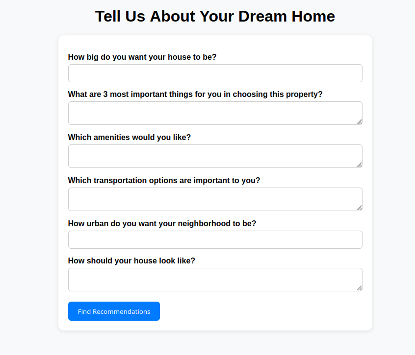
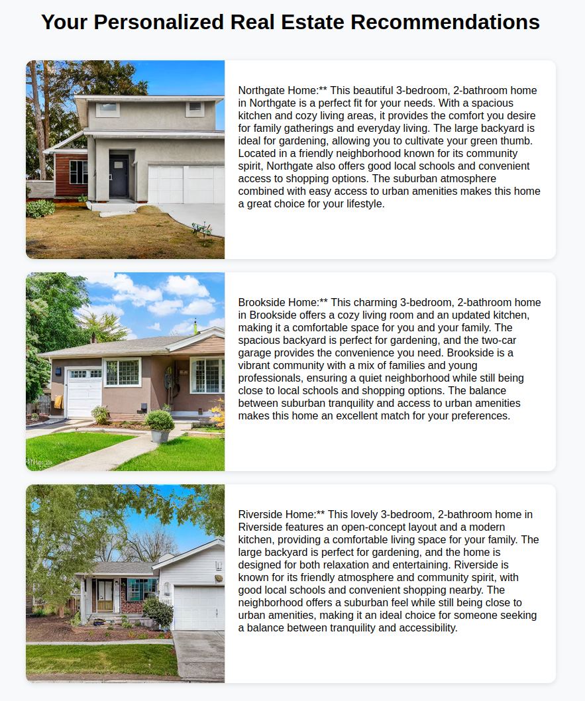
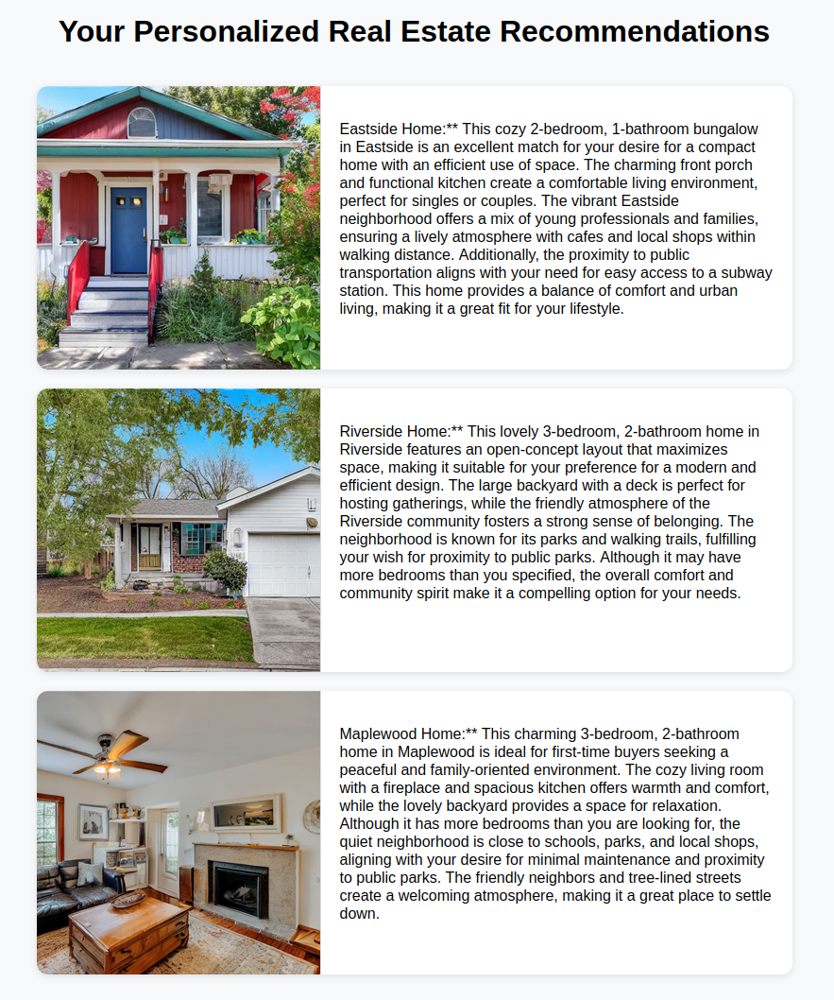
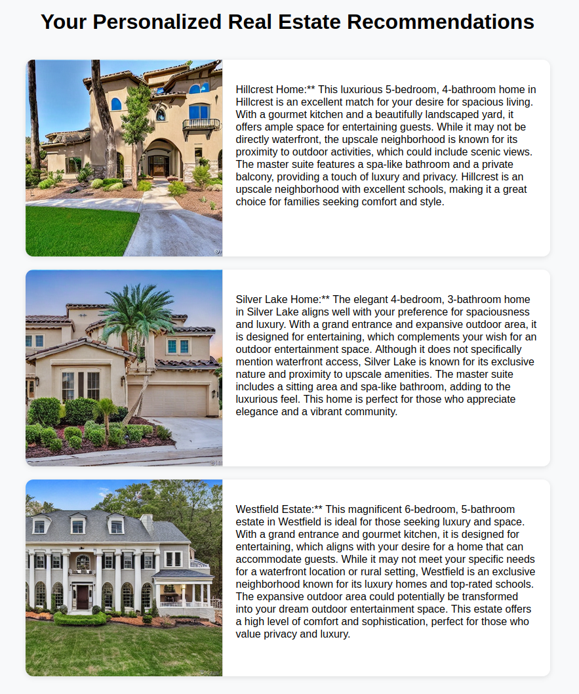

# Personalized Real Estate Agent

Final project for Udacity course [Generative AI](https://learn.udacity.com/nd608)

The [Project Rubric](#project-rubric) at then end of the readme shows the requirements and where they are implemented.

## Functionality Overview

* **Customer Input**: The customer provides responses to a set of questions regarding their desired property.
* **Prompt Generation**: An LLM generates search prompts based on the customer’s input, targeting both textual and image-based property descriptions.
* **Semantic Retrieval**: A vector database is used to retrieve the most relevant text and image listings that align with the generated prompts.
* **Result Integration**: Retrieved text and image search results are combined into a unified candidate set.
* **Personalized Output**: The top three results are further processed by an LLM to generate a tailored, customer-specific property description.

## Data Generation and Management

* **Dataset Creation**: An LLM is utilized to generate synthetic real estate datasets based on a provided example.
* **Image Generation**: Property images are produced using Stable Diffusion, derived from the corresponding dataset entries.
* **Storage and Retrieval**: A vector database stores both text and image embeddings, enabling efficient similarity-based search across modalities.


## Usage

Run server.py and open the local ip address. Fill out the questionair and press "Find Recommendations".

### Start server

```
$ python server.py
 * Serving Flask app 'server'
 * Debug mode: on
WARNING: This is a development server. Do not use it in a production deployment. Use a production WSGI server instead.
 * Running on http://127.0.0.1:5000
Press CTRL+C to quit
 * Restarting with stat
 * Debugger is active!
 * Debugger PIN: 352-998-448
```

Here the local address is `http://127.0.0.1:5000`

### Questionair



# House Preference Questionnaires

## Dataset 1: Family Suburban Preference

| Question | Answer |
|----------|--------|
| How big do you want your house to be? | A comfortable three-bedroom house with a spacious kitchen and a cozy living room. |
| What are 3 most important things for you in choosing this property? | A quiet neighborhood, good local schools, and convenient shopping options. |
| Which amenities would you like? | A backyard for gardening, a two-car garage, and a modern, energy-efficient heating system. |
| Which transportation options are important to you? | Easy access to a reliable bus line, proximity to a major highway, and bike-friendly roads. |
| How urban do you want your neighborhood to be? | A balance between suburban tranquility and access to urban amenities like restaurants and theaters. |
| How should your house look like? | A red house with big windows. |



## Dataset 2: Urban Professional Preference

| Question | Answer |
|----------|--------|
| How big do you want your house to be? | A compact two-bedroom home with an open floor plan and efficient use of space. |
| What are 3 most important things for you in choosing this property? | Proximity to public parks, low property taxes, and minimal maintenance requirements. |
| Which amenities would you like? | A home office space, high-speed internet connectivity, and smart home features. |
| Which transportation options are important to you? | Walking distance to a subway station, access to ride-sharing services, and EV charging stations. |
| How urban do you want your neighborhood to be? | A vibrant urban environment with cafes, cultural venues, and nightlife within walking distance. |
| How should your house look like? | A modern minimalist design with clean lines, neutral colors, and sustainable materials. |



## Dataset 3: Luxury Estate Preference

| Question | Answer |
|----------|--------|
| How big do you want your house to be? | A spacious four-bedroom home with a dedicated guest room and home gym area. |
| What are 3 most important things for you in choosing this property? | Waterfront location, privacy from neighbors, and stunning mountain views. |
| Which amenities would you like? | Swimming pool, outdoor entertainment area, and a gourmet chef's kitchen. |
| Which transportation options are important to you? | Private boat dock, helicopter landing pad, and secure underground parking. |
| How urban do you want your neighborhood to be? | A secluded rural setting with complete privacy and natural surroundings. |
| How should your house look like? | A luxurious Mediterranean villa style with arched windows and terracotta roof tiles. |




## Preparation

### Data Creation

Call the script `generate_data.py`, the output will be in data/data.json and shown in the terminal.

```
$ $ python create_data.py 
INFO - Starting data generation
INFO - Initialize LLM gpt-4o-mini
INFO - Invoke LLM pipeline
{
  "RealEstateObj": [
    {
      "Neighborhood": "Sunnyvale",
      "Price": "$750,000",
      "Bedrooms": 4,
      "Bathrooms": 3,
      "HouseSize": 2500,
      "Description": "This spacious 4-bedroom, 3-bathroom home in Sunnyvale is perfect for families. The open floor plan features a modern kitchen with stainless steel appliances, a large living room with a fireplace, and a backyard ideal for entertaining. Located near top-rated schools and parks, this home is a family\u2019s dream come true.",
      "NeighborhoodDescription": "Sunnyvale is a family-friendly neighborhood with excellent schools, parks, and recreational facilities. The community hosts regular events, making it easy to meet neighbors and build lasting friendships."
    },

[...]

    {
      "Neighborhood": "Silver Lake",
      "Price": "450,000",
      "Bedrooms": 2,
      "Bathrooms": 1,
      "HouseSize": 950,
      "Description": "This cozy 2-bedroom, 1-bathroom home in Silver Lake is perfect for singles or couples. With a small garden and a welcoming atmosphere, it\u2019s an ideal starter home.",
      "NeighborhoodDescription": "Silver Lake is a friendly neighborhood with a strong sense of community. Enjoy local cafes, parks, and a relaxed lifestyle."
    }
  ]
}
INFO - Finished data generation
```

### Image Generation

Call the script `generate_images_diff.py`, the output will be in house_images.

```
$ python create_images_diff.py 
INFO - Start CreateImages
INFO - Create OpenAI client
INFO - Create prompt for Sunnyvale
INFO - Create image for Sunnyvale
Loading pipeline components...: 100%|████████████████████████████████████████████████████████████████████████████████████████████████████| 7/7 [00:00<00:00,  8.52it/s]
100%|██████████████████████████████████████████████████████████████████████████████████████████████████████████████████████████████████| 50/50 [00:02<00:00, 23.34it/s]
INFO - Write image as house_images/0.png
[...]
INFO - Create prompt for Silver Lake
INFO - Create image for Silver Lake
Loading pipeline components...: 100%|████████████████████████████████████████████████████████████████████████████████████████████████████| 7/7 [00:00<00:00,  8.97it/s]
100%|██████████████████████████████████████████████████████████████████████████████████████████████████████████████████████████████████| 50/50 [00:01<00:00, 25.43it/s]
INFO - Write image as house_images/16.png
INFO - Finished CreateImages
```

### Database creation

The script `database.py`has to be called with `--add-data argument`. The old database `.chroma_db` should be deleted first.

```
$ python database.py --add-data
INFO - Started database handling
INFO - Creating or loading the collections for text and images
INFO - Adding data to the database collections
INFO - Loading data
INFO - Starting loop
INFO - Adding data for Sunnyvale
INFO - Adding data for Downtown
INFO - Adding data for Maplewood
INFO - Adding data for Hillcrest
INFO - Adding data for Riverside
INFO - Adding data for Lakeside
INFO - Adding data for Old Town
INFO - Adding data for Cedar Grove
INFO - Adding data for Westfield
INFO - Adding data for Eastside
INFO - Adding data for Southridge
INFO - Adding data for Northgate
INFO - Adding data for Forest Hill
INFO - Adding data for Brookside
INFO - Adding data for Seaside
INFO - Adding data for Pine Valley
INFO - Adding data for Silver Lake
INFO - Loop finished
INFO - Adding text data to collection
INFO - Adding image data to collection
INFO - Finished database handling
```


## Design Decisions

* The sample house information follows a structured format; therefore, the samples were generated using the Structured Output API and stored in JSON files.
* Images were produced with a local Stable Diffusion model. An initial attempt with DALL·E proved slower and delivered lower quality results.
* For populating the vector database, the LangChain Chroma API was tested. However, it provided limited control over how data was stored, as the JSON loader ingested the entire JSON structure directly. To address this, the original Chroma API was used with a custom loader that stored only the relevant information from the JSON dataset, along with the required metadata.
* Search result merging combines both text and image search. First, a broad list of top image matches and a shorter list of text matches are retrieved. The final results are selected by identifying datasets with the highest-ranked image matches that also appear in the text match list.
* For text and image search, two distinct prompts were generated by the LLM, each tailored to the customer information and optimized for the respective data type.

## Project Rubric

### 1. Synthetic Data Generation

* **Requirement**: A minimum of **10 diverse and realistic real estate listings** are generated using an LLM, each containing factual property details.
* **Implementation**: [`create_data.py`](./create_data.py)
* **Output**: [`data/data.json`](./data/data.json)

### 2. Semantic Search

* **Requirement**:

  * A **vector database** is created to store embeddings of the generated listings.
  * The database successfully **stores and organizes embeddings** derived from LLM-created listings.
  * The application supports **semantic search functionality** that retrieves listings most relevant to specified buyer preferences.
* **Implementation**: [`database.py`](./database.py)
* **Output**: .chroma_db

### 3. Augmented Response Generation

* **Requirement**:

  * The system includes **logic to search and augment listing descriptions** based on buyer preferences, while preserving factual accuracy.
  * **Personalized descriptions** are generated with an LLM, ensuring they are tailored, engaging, and aligned with buyer preferences.
* **Implementation**: [`llm.py`](./llm.py)
* **Output**: html page (from the webserver) or stdout (from the llm main function)


### 4. Suggestions to Enhance the Project

To further distinguish the project, **multimodal search capabilities** can be incorporated through the integration of **CLIP**. This extension would allow the application to perform searches across both textual descriptions and property images. By combining textual and visual representations, the system would be able to align **visual property features** (e.g., style, layout, surroundings) with **textual buyer preferences**.

* **Requirement**:

  * **Image Embeddings**: Generate embeddings for real estate images using CLIP and store them in the vector database alongside text embeddings.
  * **Multimodal Search Logic**: Implement search functionality that considers both text and image embeddings to retrieve listings matching buyer preferences, including visual aspects.
* **Implementation**: [`create_images_diff.py`](./create_images_diff.py) (creates images with stable diffusion), [`database.py`](./database.py) (adds the image embeddings to the vector database)
* **Output**: `images`, `.chroma_db`

### 5. User interface (optional)

* **Requirement**:

  * **Get user input**: Ask user questions and process the answers with the algorithm. Present the recommendations.
* **Implementation**: [`server.py`](./server.py) webserver, [`user_data.py`](./user_data.py) with sample answers for testing
* **Output**: local webserver
